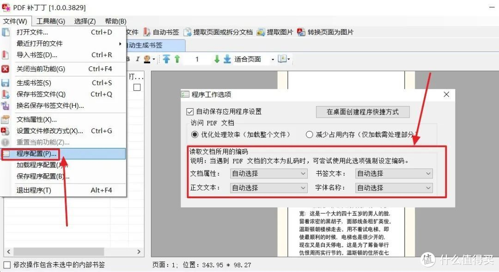

**内置[阅读器](https://www.smzdm.com/ju/s2l6vz1/)**

我知道，PDF 补丁丁这名字说出来肯定会有很多人陌生，其实这个 PDF 补丁丁就是挺有名的绿色工具 PDFPatcher，至今为止已有 12 年的历史。

不过像这种有年头的工具，「通病」是样貌简陋，PDF 补丁丁自然也没能免俗。

但简陋的 UI 并不能阻挡它的强大，反而当它主页干干净净地把功能都展示出来，我一见倾心。

补丁丁内置有 PDF 阅读器，当你在右侧点击「打开需要修改的文件」，就能将待操作的 PDF 文件导入进来，支持调整浏览界面，支持黑暗模式和护眼模式。

如果你的 PDF 文件是竖版古籍，作者也贴心地准备了「从右往左」的阅读模式。

如果 PDF 文件内嵌的信息文件存在书签目录，那这个阅读器也会自动读取目录，可跳转的那种：

**书签编辑**

当然，我们也能右键对现成的书签颜色、动作等等属性进行批量修改。

也可以自己为 PDF 添加书签。

无论是修改过的书签，还是自定义的书签，补丁丁都支持导入导出，方便你备份整理，还能内嵌到 PDF 文件中。

如果你的 PDF 文档质量够高，补丁丁甚至支持自动生成书签目录，主页的那个「自动生成书签」就是干这个事的。

你可以根据文本内容、文本尺寸、文本字体、文本位置等等条件，通过正则表达式让补丁丁自动筛选出符合标准的标题。

**去除限制**

前面不是说有的 PDF 文件打开会是乱码，或 PDF 文件本身有复制和打印的限制嘛，补丁丁能帮你一键去除。

在阅读器的界面，点击左上角的「文件 - 设置文件修改方式」，或者直接热键「Ctrl+G」唤出窗口。

你可以设置「页面尺寸」：

可以强制转换 PDF 上的外部链接：

更厉害的是「压缩清理」这一栏，清除复制、打印的限制，还能尝试修改文档错误，或清除 PDF 的信息。

至于乱码，你在阅读器界面找到「程序配置」，然后自己强制更改编码就好了。

**合并拆分**

补丁丁的强大在去除限制、清除信息方面展露无遗，当然也不会漏过合并拆分这种 PDF 的基操。

在「合并文档」这一功能界面，选择待合并的文档，然后在「输出 PDF 文件」那里给输出文件命名，点击生成就轻松搞定了。

甚至连书签也都合并了，绝不会给你带来不必要的烦恼。

当然，PDF 文件之间是可以合并的，补丁丁还能把图片合成 PDF 文件，我之前下载了不少漫画，都是 .jpg 格式的，选择文件夹就能得到一个 PDF 格式的漫画。

能合自然能拆，在「提取页面」这一功能界面里，可以把一份文档拆分成多份分档。

其奥秘就在「页码范围」和「排除页面范围」这两块，通过分号按页码拆分，再复杂的场景都能简单搞定 ——

比如你想把一个 PDF 文件拆分成两个文件，一个是前 3 页，另一个是包含第 3 页和 5 到 10 页两部分，这种需求够复杂了吧，你只要在补丁丁的「页码范围」输入「1-3;3,5-10」就能成功拆分。

**其他**

说实话写到这，我只不过介绍了 PDF 补丁丁亮点的一隅，它真的是太强了，这次限于篇幅，剩下的主要功能我就不说具体操作步骤了啊。

**提取图片**

补丁丁是可以提取 PDF 中的图片的，可以限定提取图片的大小，可以避免提取出重复的图片，还可以自定义提取图片的名称。

所有的图片都保留在了你指定的导出目录，我反复测试了好几次，毫不夸张的说，PDF 补丁丁的提取图片功能是目前为止，我见过最快最给力的。

**替换字体**

在之前去除限制那个小节，其实还藏了个强大功能，就是替换字体，补丁丁会自动识别出当前 PDF 文件的字体，然后你按自己的喜好替换即可。

记得勾选「嵌入字库」这个选项，它能帮你有效清除乱码这个问题，没有字库的设备（比如 Kindle）上也可以正常阅读。

**批量重命名**

补丁丁不是可以识别 PDF 的信息嘛，如果你想批量给自己的 PDF 文件的名字后面加上作者，就可以在「重命名文件」这个功能界面实现。

命名前有个测试，你可以查看输出的名字是否符合心意。

**最后**

PDF 补丁丁有多强大，相信你已经有了个初步的了解吧，使用一圈下来，我最大的感受就是作者真的太用心了 ——

无需安装随开随用的绿色版本，悬停[鼠标](https://www.smzdm.com/fenlei/shubiao/)时无处不在的功能简介，一环套着一环全方位的 PDF 设置，甚至博客里还有个作者自己撰写的 84 页说明书。

可就这样一款功能强大，作者用心，免费绿色，持续维护更新 12 年的神器，在两个月前，被作者 @wmjordan 开源到了 GitHub。

没有什么限制，不要什么捐赠，只有一个附加要求 —— 希望使用者都可以行一善。

看到这个，我心里是佩服的，佩服他 12 年里的更新，更佩服他开源后「良心授权」的情怀，何为侠义气，莫过于此。

作者的博客在这里：https://www.cnblogs.com/pdfpatcher

PDF 补丁丁的 GitHub 地址在这里：https://github.com/wmjordan/PDFPatcher

我自己也存了一份最新的补丁丁，，有需要的小伙伴关注自取好了，或者跟我联系哦。只是，大家别忘了作者的「良心授权」，且用且珍惜。